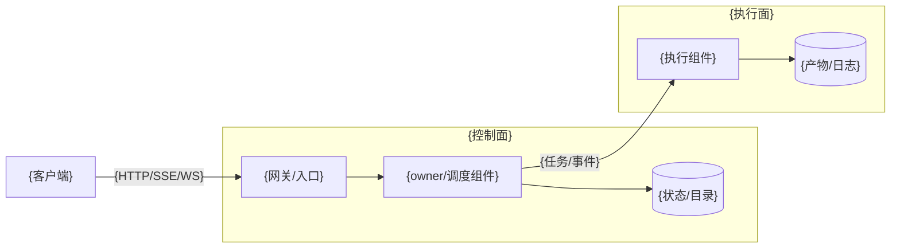
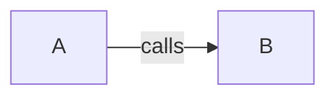

# Architecture Diagram Builder

## Purpose

Use this skill to turn architecture facts into diagrams that can live inside Markdown documents.

The final output must be embeddable in Markdown. A diagram that only exists as an online canvas, whiteboard, or editor state is not a valid final artifact unless it is exported to SVG, PNG, `.drawio.svg`, or inline SVG and inserted into the document.

## When To Use

Use this skill when the user asks to:

- 画架构图、系统图、模块图、组件图、部署图、拓扑图、链路图、时序图、迁移图或可靠性/路由图。
- 把架构图放进 Markdown、KU 文档、设计文档、README、Obsidian 或其他 md 文档。
- 把已有文字设计转成可读的架构图。
- 改写已有 Mermaid、SVG、draw.io 或图片架构图。

Do not use this skill for purely decorative illustrations, UI mockups, presentation-only graphics, or knowledge graphs whose goal is token compression rather than architecture communication.

## Output Contract

Every response or generated artifact must include one of these Markdown-embeddable forms:

1. Mermaid fenced block, preferred for maintainable text diagrams.
2. Markdown image link to a local or repository asset: ``.
3. `.drawio.svg` that can be both viewed as SVG and reopened in draw.io-compatible editors.
4. Inline SVG when a single self-contained Markdown file is required.

If using canvas, Figma, FigJam, Excalidraw, HTML canvas, or another drawing surface:

- Export the final diagram to SVG or PNG.
- Keep the editable source file when possible.
- Insert the exported asset into Markdown.
- Do not leave the canvas URL as the only deliverable.

## Workflow

1. Identify the diagram question.
   - What should the reader understand after looking at the diagram?
   - Is this a context, component, deployment, control-flow, data-flow, protocol, reliability, or migration diagram?
   - What should be excluded?

2. Extract architecture facts.
   - Nodes: users, services, modules, adapters, queues, stores, runtimes, external systems.
   - Boundaries: process, network, tenant, team, trust zone, deployment unit.
   - Edges: calls, events, reads/writes, routing, ownership, replay, failover.
   - Labels: protocol, payload, sync/async, success/failure meaning.

3. Choose the representation.

| Situation | Use |
| --- | --- |
| Simple component or flow diagram, up to about 15 nodes | Mermaid `flowchart` |
| Protocol or event order matters | Mermaid `sequenceDiagram` |
| State transitions are central | Mermaid `stateDiagram-v2` |
| Data entities and relations are central | Mermaid `erDiagram` |
| Layout, swimlanes, deployment zones, or visual grouping are too complex for Mermaid | SVG, PNG, or `.drawio.svg` |

4. Draw the smallest useful diagram.
   - One diagram should answer one main question.
   - Split control flow and data flow when mixing them would confuse readers.
   - Split normal path and failure/recovery path when both are non-trivial.

5. Embed and explain.
   - Put the Mermaid block or image link directly in the Markdown.
   - Add a one-sentence caption.
   - Add a short table for nodes or critical links when labels alone are not enough.

6. Verify.
   - Check that all arrows have direction and important arrows have labels.
   - Check that boundary ownership is visible.
   - Check that the diagram remains readable in Markdown preview.
   - Check that no invented component, protocol, owner, or failure behavior was added.

## Mermaid Rules

- Use `flowchart LR` by default for architecture diagrams.
- Use quoted labels when text contains punctuation, Chinese punctuation, slashes, spaces, or parentheses.
- Use `subgraph` for meaningful boundaries such as client, gateway, runner, storage, control plane, data plane, or external systems.
- Label cross-boundary arrows.
- Keep node labels short; put detailed explanations in the table after the diagram.
- Avoid style-heavy Mermaid unless the style communicates new/changed/deprecated status.

Example:



## Markdown Insertion Rules

Mermaid:

````markdown

````

Asset:

```markdown

```

Inline SVG is acceptable only when the Markdown renderer supports raw HTML/SVG and the file remains readable.

## KU Template Integration

When `ku-analysis-template-builder` uses this skill:

- Prefer producing a Mermaid block when the target KU/Markdown renderer supports Mermaid.
- Use SVG/PNG/`.drawio.svg` when the diagram requires complex spatial layout.
- Return both the diagram block or asset path and a short explanation table so it can be placed into the selected KU template.
- If source material is insufficient, output a diagram inventory and missing inputs instead of inventing the architecture.
